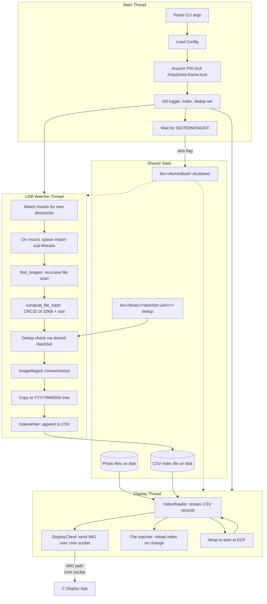

# Digital Photo Frame

This is a small Rust program that runs a photo slideshow on a Raspberry Pi Zero 2 W. It pairs with a tiny C graphics app that actually draws the pictures to the screen. No desktop environment needed. It talks to the GPU directly.

## What it does

The Rust side runs three threads in the background:

Photo display reads a CSV list of photos and sends paths to the C app over a Unix socket. The C app loads each image, fades it in, and shows it for a while. The socket naturally paces things: if the C app is busy, the Rust side blocks until it can send the next photo.

USB import watches `/media` for USB drives. When you plug one in, it scans for JPEGs and HEICs, checks if you already have them (using a quick hash), converts them to your screen's resolution, and copies them into a `YYYY/MM/DD` folder tree.

Storage cleanup kicks in automatically if the photo partition fills up. It deletes the oldest batch of photos to make room.

## Where it runs

- Raspberry Pi Zero 2 W is the main target. The C app uses the VideoCore GPU for OpenGL ES rendering.
- Debian VM (UTM/QEMU) works too. GPU acceleration helps; without it, Mesa falls back to CPU rendering (llvmpipe) and fades get choppy.
- Other Linux boards probably work if they have DRM/GBM/EGL support and a Mesa driver. Hardware acceleration helps a lot at 1080p.

## How it fits together



**Thread breakdown:**

1. The main thread parses args, loads the TOML config, grabs a PID lock (`/tmp/photo-frame.lock`), sets up logging and the photo index, then starts the two worker threads. It sits waiting for `SIGTERM` or `SIGINT`. When it gets one, it flips a shutdown flag and exits after 200ms. It doesn't wait for workers to finish, since they might be stuck in I/O. The OS cleans up.

2. The display thread opens the CSV index and loops through records one by one. For each photo, it sends `IMG <path>\n` over the Unix socket. The write blocks if the C app's buffer is full, so the slideshow naturally stays in sync with the screen. At EOF, it wraps back to the start. If the index file gets rewritten (e.g., after a USB import), an inotify watcher notices and the reader reopens it. The first photo is picked at random so you don't always start with the same one.

3. The USB watcher thread watches `/media` for new directories. When a drive mounts, it spawns a thread to handle the import. That thread recursively scans for images, hashes the first 32KB plus file size, checks against the shared dedup set, runs ImageMagick to resize, copies the result into `photos_dir/YYYY/MM/DD/`, and appends a line to the CSV. If the disk is full, it triggers rotation (deletes oldest photos) and retries.

Some design choices that might matter:

- Everything is synchronous. We use `std::thread::spawn` for concurrency and plain blocking I/O. This keeps dependencies small and avoids pulling in tokio.
- The display app doesn't respond to protocol messages. Backpressure is just the kernel socket buffer. When it's full, the Rust side blocks. That is the whole mechanism.
- Deleted entries stay in the CSV file as ghosts. The filename tracks the valid range (`index-<start>-<count>.csv`). When ghosts exceed 50%, the file gets rewritten.
- Logs go to `/tmp` (tmpfs), so there is no SD card wear from logging. The photo partition uses `noatime,lazytime`.

## The C display app

The C app (`c/photo-frame-display.c`) handles all the graphics. It opens a DRM device directly, with no X11 or Wayland involved. GBM allocates framebuffers, EGL sets up an OpenGL ES 2.0 context, and images are loaded with stb_image and drawn as textured quads. Fade transitions are just alpha blending between two textures.

## Project Structure

The rough structure of the project is this.

```
photo-frame/
├── c/
│   ├── C display app source code
├── demos/   
│   ├── Original demo/PoC code, kept for historical purposes
├── src/                    
│   ├── Rust manager source code
├── Makefile  # builds everything
```

## Reference Documentation

- [plans/SPEC.md](plans/SPEC.md) — Living specification: what features exist and how they operate.
- [docs/building.md](docs/building.md) — Build instructions and Makefile options.
- [docs/running.md](docs/running.md) — How to run the apps locally.
- [docs/config.md](docs/config.md) — Configuration reference.
- [docs/deployment.md](docs/deployment.md) — DietPi setup, packaging, and installation.

## License

This project is licensed under the [GNU Affero General Public License v3.0](LICENSE) or later.
