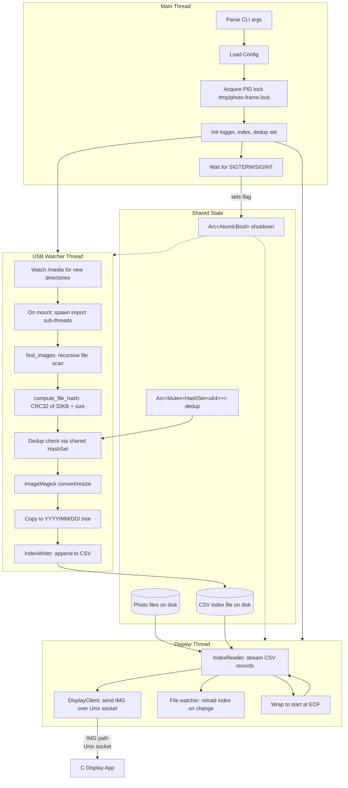

# Digital Photo Frame

This is a small Rust program that runs a photo slideshow on a Raspberry Pi Zero 2 W. It pairs with a tiny C graphics app that actually draws the pictures to the screen. No desktop environment needed. It talks to the GPU directly.

## What it does

The Rust side runs three threads in the background:

Photo display reads a CSV list of photos and sends paths to the C app over a Unix socket. The C app loads each image, fades it in, and shows it for a while. The socket naturally paces things: if the C app is busy, the Rust side blocks until it can send the next photo.

USB import watches `/media` for USB drives. When you plug one in, it scans for JPEGs and HEICs, checks if you already have them (using a quick hash), converts them to your screen's resolution, and copies them into a `YYYY/MM/DD` folder tree.

Storage cleanup kicks in automatically if the photo partition fills up. It deletes the oldest batch of photos to make room.

## Where it runs

- Raspberry Pi Zero 2 W is the main target. The C app uses the VideoCore GPU for OpenGL ES rendering.
- Debian VM (UTM/QEMU) works too. GPU acceleration helps; without it, Mesa falls back to CPU rendering (llvmpipe) and fades get choppy.
- Other Linux boards probably work if they have DRM/GBM/EGL support and a Mesa driver. Hardware acceleration helps a lot at 1080p.

## How it fits together



**Thread breakdown:**

1. The main thread parses args, loads the TOML config, grabs a PID lock (`/tmp/photo-frame.lock`), sets up logging and the photo index, then starts the two worker threads. It sits waiting for `SIGTERM` or `SIGINT`. When it gets one, it flips a shutdown flag and exits after 200ms. It doesn't wait for workers to finish, since they might be stuck in I/O. The OS cleans up.

2. The display thread opens the CSV index and loops through records one by one. For each photo, it sends `IMG <path>\n` over the Unix socket. The write blocks if the C app's buffer is full, so the slideshow naturally stays in sync with the screen. At EOF, it wraps back to the start. If the index file gets rewritten (e.g., after a USB import), an inotify watcher notices and the reader reopens it. The first photo is picked at random so you don't always start with the same one.

3. The USB watcher thread watches `/media` for new directories. When a drive mounts, it spawns a thread to handle the import. That thread recursively scans for images, hashes the first 32KB plus file size, checks against the shared dedup set, runs ImageMagick to resize, copies the result into `photos_dir/YYYY/MM/DD/`, and appends a line to the CSV. If the disk is full, it triggers rotation (deletes oldest photos) and retries.

Some design choices that might matter:

- Everything is synchronous. We use `std::thread::spawn` for concurrency and plain blocking I/O. This keeps dependencies small and avoids pulling in tokio.
- The display app doesn't respond to protocol messages. Backpressure is just the kernel socket buffer. When it's full, the Rust side blocks. That is the whole mechanism.
- Deleted entries stay in the CSV file as ghosts. The filename tracks the valid range (`index-<start>-<count>.csv`). When ghosts exceed 50%, the file gets rewritten.
- Logs go to `/tmp` (tmpfs), so there is no SD card wear from logging. The photo partition uses `noatime,lazytime`.

## The C display app

The C app (`c/photo_frame.c`) handles all the graphics. It opens a DRM device directly, with no X11 or Wayland involved. GBM allocates framebuffers, EGL sets up an OpenGL ES 2.0 context, and images are loaded with stb_image and drawn as textured quads. Fade transitions are just alpha blending between two textures.

## Project Structure

The rough structure of the project is this.

```
photo-frame/
├── c/
│   ├── C display app source code
├── demos/   
│   ├── Original demo/PoC code, kept for historical purposes
├── src/                    
│   ├── Rust manager source code
├── Makefile  # builds everything
```

## Building

### Makefile Options

```bash
make              # C display app + Rust manager (native)
make c            # C app only
make rust         # Rust manager only
make test         # Run Rust tests
make clean        # Clean everything
make run-display  # Runs the C display app
make run-manager  # Runs the Rust manager app
```

You might be able to cross compile this, but it honestly builds pretty quick even on the Raspberry PI Zero 2W. I'd recommend just building on-device.

#### C display app requirements

Needs: `gcc`, `libdrm-dev`, `libegl1-mesa-dev`, `libgbm-dev`

#### Rust manager app requirements

Needs: `rustup` & stable Rust toolchain.

#### Debian VM with GPU acceleration (UTM/QEMU)

For testing/development, I work on a Debian VM. For smooth fades, enable VirGL in your VM:

1. I run on MacOS and use UTM. In UTM, edit the VM settings, go to Display. From the drop down, pick an option that includes GPU. There were a few on my MacBook Pro, I went with `virtio-gpu-gl-pci (GPU Supported)`.
2. In the VM:

```bash
sudo apt update
sudo apt install -y gcc make libdrm-dev libegl1-mesa-dev libgbm-dev mesa-utils
```

3. Check acceleration:

```bash
eglinfo | grep -i "renderer"
# You want "virgl (ANGLE ...)" for host GPU acceleration
# "llvmpipe (...)" means CPU rendering; fades will be jerky & consume lots of CPU
```

## Running

For development, use the `Makefile` options listed above.

Here's what the make commands are doing:

```bash
# Start the display app first (on the Pi)
./c/photo_frame

# Then the manager
./photo-frame /path/to/config.toml

# Or import from a local folder at startup (no USB needed)
./photo-frame --import-dir /path/to/photos /path/to/config.toml
```

### Config (`config.toml`)

```toml
photos_dir = "/mnt/photos"
socket_path = "/tmp/photo-frame.sock"
native_resolution = "1920x1080"
aspect_ratio_mode = "fit"   # or "fill"
batch_delete_size = 20
log_max_size = 262144       # 256 KiB
log_max_files = 2
```

### Display app environment variables

```bash
# Fade duration in seconds. 0 = instant cut.
PHOTO_FRAME_FADE_DURATION=1.5 ./c/photo_frame

# Skip frames during fade to reduce CPU. 0 = every frame, 1 = every 2nd, etc.
PHOTO_FRAME_SKIP_FRAMES=1 ./c/photo_frame
```

## DietPi setup

### 1. Don't expand the rootfs

Before first boot, mount the SD card's ext4 partition on another computer and delete the resize symlink:

```bash
rm <mount>/etc/systemd/system/local-fs.target.wants/dietpi-fs_partition_resize.service
```

This keeps root at ~900MB, leaving the rest of the card for a photos partition.

### 2. Create the photos partition

After first boot:

```bash
sudo parted /dev/mmcblk0
# (parted) mkpart primary ext4 <start> 100%
# (parted) quit

sudo mkfs.ext4 /dev/mmcblk0p3
sudo mkdir /mnt/photos
sudo mount /dev/mmcblk0p3 /mnt/photos

# Add to /etc/fstab:
# PARTUUID=<uuid> /mnt/photos ext4 noatime,lazytime 0 2
```

### 3. Install packages

```bash
sudo apt update
sudo apt install -y usbmount imagemagick
```

### 4. USB auto-mount

`usbmount` handles auto-mounting to `/media/usb0`, `/media/usb1`, etc. You can also use DietPi's `dietpi-drive_manager`.

### 5. Display app

The Rust manager needs the C display app (`photo_frame.c`) running alongside it. See `c/photo_frame.c` in this repo.

## Storage rotation

When the photos partition fills up (`ENOSPC`), the app deletes the oldest `batch_delete_size` photos. The CSV index keeps ghost entries until compaction, which happens on startup if ghosts exceed 50%.

## Shutdown

The app handles `SIGTERM` and `SIGINT`. It closes the socket immediately and exits. It won't finish sending a half-sent image, since the display app handles disconnects fine.

## License

[Add your license here]
